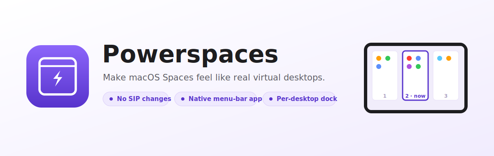

<p align="center">
  
</p>

# powerspaces

**Make macOS Spaces behave like Microsoft Windows virtual desktops.** Every
desktop is isolated, with its own dock, and no more getting *yanked* to a different
desktop just because you clicked an app or searched for one. Powerspaces calls
each Space a **desktop**, the way macOS labels them (Desktop 1, Desktop 2, …).

It **augments** native Spaces, so you keep your swipe gestures and Mission Control; it
doesn't replace them like AeroSpace/FlashSpace. No SIP changes, no kernel
extensions, no Screen Recording.

📚 **Docs:** [User guide](docs/user-guide.md) · [Getting started](docs/getting-started.md) · [docs index](docs/README.md)

## What it solves

macOS quietly treats all your Spaces as one blurred-together pile: apps, the
Dock, and ⌘-Tab all reach across every desktop, so you keep getting thrown to a
desktop you didn't ask for. Powerspaces makes each desktop feel like its own
separate computer.

| The problem | How Powerspaces fixes it |
|---|---|
| You click an app's **Dock icon** while that app is already open on another desktop, and macOS **yanks you across to that other desktop**. | Powerspaces **focuses the app's window only if one is already on the desktop you're on; otherwise it opens a brand-new window right here.** It never jumps you away. |
| You search for an app in **Spotlight or Raycast**, and it activates the copy living on another desktop, throwing you over there. | A built-in **App Launcher** (plus an optional **Raycast extension**) opens any app **on the desktop you're currently standing on**, never on a different one. |
| The macOS **Dock shows every app from every desktop**, so you can't tell what's actually open *here*. | A **per-desktop dock** that shows **only the apps with a window on your current desktop**, and follows you as you move between desktops. |
| **⌘-Tab cycles through the windows of every desktop**, not just the one in front of you. | Powerspaces **integrates [AltTab](https://alt-tab.app)** and configures it, in one click, to switch only between **the current desktop's windows**. |

The single idea behind all of it: **focus the app here if it's already here,
otherwise open it here, and never jump you to another desktop.**

## Why we integrate AltTab (instead of reinventing it)

Per-desktop ⌘-Tab is the one piece we deliberately *don't* build ourselves.
[AltTab](https://alt-tab.app) is an excellent, open-source window switcher that
already nails the hard parts, and a single one of its settings (*"show windows
from the active Space"*) scopes it to the current desktop. Rather than reinvent
a fragile Cmd-Tab event tap, Powerspaces **detects (or installs) AltTab and sets
that filter for you in one click** from Preferences → System. Making ⌘-Tab the
actual trigger is a quick, guided one-time step in AltTab's own settings. No
wheel reinvented.

## Install

Install with Homebrew:

```sh
brew tap sebastianpdw/tap
brew trust sebastianpdw/tap            # Homebrew 6.0+: trust a third-party tap
brew install --cask powerspaces        # copies Powerspaces.app into /Applications
```

Powerspaces is Apple **Developer-ID signed and notarized**, so it launches with no
Gatekeeper warning — just open it and grant **Accessibility** when prompted. (No
`xattr`, no right-click → Open.) The prebuilt build is **Apple Silicon only**.

Prefer to build from a clone, or want the `powerspaces` CLI too? See
**[Getting started](docs/getting-started.md)**.

## How it works

The decision is a pure function of a window/space snapshot, so it's testable
without the live window server:

| Situation | Decision |
|---|---|
| App has a window on the current desktop | **focus** that exact window (no jump) |
| App isn't running at all | **launch** it (first window lands here) |
| App runs only on other desktops | **new window** here, via a per-app strategy |

Space membership is read via private SkyLight/CGS calls (`CGSCopyManagedDisplaySpaces`,
`CGSCopySpacesForWindows`), the same read-only path AltTab uses. **No SIP changes
required.**

### The honest limitation
Creating a *new window of an already-running app on the current desktop* is
app-dependent. `newInstance` (`open -na`) works for multi-instance apps
(browsers, terminals, editors); single-instance apps (Messages, System Settings)
can't get a second window, so they use the `focusOnly` fallback (which still
jumps). Strategies are configurable per app; see `config.example.json`.

## Layout

```
Sources/SpaceKit/           # library (unit-tested core)
  Models.swift              # SpaceID, WindowInfo, SpaceSnapshot, AppTarget
  SpaceProviding.swift      # the protocol seam (real vs fake)
  CGSPrivate.swift          # @_silgen_name private window-server bindings
  CGSSpaceProvider.swift    # live provider (CGS + CGWindowList)
  LaunchEngine.swift        # pure decide(): the heart
  StrategyConfig.swift      # per-app new-window strategies + JSON config
  Launcher.swift            # executes a decision (NSWorkspace/open/AppleScript/AX raise)
  DockModel.swift           # per-Space app list for the dock
  AppResolver.swift         # name/bundle-id -> target + app URL
Sources/powerspaces/        # CLI (also the Raycast hook and the spike tool)
Sources/PowerspacesApp/     # menu-bar agent + floating per-desktop dock (AppKit)
Sources/SpaceKitTestRunner/ # dependency-free test suite
```

## Build

Needs the Swift toolchain (Command Line Tools is enough, no full Xcode).

```sh
swift build -c release
```

## Test

XCTest/Swift Testing aren't available with CLT-only, so the suite is a plain
executable:

```sh
swift run spacekit-tests      # prints the assertion count; exit 0 = all green
```

## CLI

```sh
swift run powerspaces current-space          # active Space id
swift run powerspaces list-windows [--all]   # windows on the current Space (or all)
swift run powerspaces decide <app> [--new]   # show the decision, no action
swift run powerspaces open   <app> [--new]   # do it
```

`<app>` is a name ("Firefox") or bundle id ("org.mozilla.firefox"). `--new`
forces a brand-new window even if one already exists here.

Install for everyday use:

```sh
sudo cp .build/release/powerspaces /usr/local/bin/powerspaces
```

## Raycast / Spotlight integration

Use the bundled **Raycast extension** in [`raycast-extension/`](raycast-extension/)
(it shells out to `powerspaces open`). Searching an app in Raycast then opens it on
the current desktop instead of jumping to wherever it already runs.

## The per-desktop dock

```sh
swift run PowerspacesApp
```

A floating bar appears at the bottom of the screen showing only the apps on the
current desktop; it follows you as you switch desktops. Click = smart-launch;
Shift/Option-click = force a new window. Flip on **Preferences → System → Hide
the macOS Dock** so this is your only dock (it auto-hides Apple's Dock for you and
restores it when you quit). Grant **Accessibility** when prompted (needed to
raise the exact window).

**Multiple monitors:** powerspaces puts an independent dock on each screen. Every
bar shows only that screen's apps, and clicking it opens/focuses windows on that
screen, so two screens behave like two desktops. Pick which screens get a dock in
**Preferences → Dock → Screens** (all screens, or a multi-select of specific ones).

### Run it as a Mac app (proper Dock icon)

`swift run PowerspacesApp` runs a **bare, unbundled executable**, so it has no app
identity: when the Preferences window opens, macOS gives it the generic icon
labelled **"exec"** in the Dock. That's not fixable at runtime, because
`NSApp.applicationIconImage` doesn't override the Dock icon for an unbundled
binary. The fix is to wrap it in a `.app` bundle:

```sh
./scripts/make-app.sh        # builds Powerspaces.app (icon + Info.plist)
open ./Powerspaces.app       # run it (still a menu-bar agent)
```

Now the Dock shows the powerspaces "power window" icon and the name **Powerspaces**.
`make-app.sh` builds the release binary, renders `AppIcon.icns` from the in-app
icon drawing (`Sources/PowerspacesApp/AppIcon.swift`, via a headless
`PowerspacesApp --export-iconset`), and wraps it with an `Info.plist` whose
`LSUIElement` flag keeps it a menu-bar-only agent, matching the runtime
`setActivationPolicy(.accessory)`. The prebuilt Homebrew release is Apple
Developer-ID signed & notarized; a local `make-app.sh` build is ad-hoc signed,
which is fine for personal use.

## Configuration

**Preferences window:** open it from the menu-bar icon (the white power-window glyph → *Preferences…*, ⌘,).
Seven tabs, each with a Basic/Advanced toggle:

- **Dock:** bar position, material, height, outline, auto-hide, per-desktop indicator, screens, color.
- **Icons:** icon size/spacing and the running-app indicator (dim not-running, or box running).
- **Effects:** hover magnify/highlight and the add/remove icon animation.
- **Windows:** one icon per window, live window titles, and the **App Launcher** tile (a Launchpad-style grid of every installed app, opened on the current desktop).
- **Behavior:** click actions, close-to-quit, refresh interval, faster desktop switch, warning banner.
- **New windows:** the default launch strategy for unknown apps (per-app rules live in each icon's right-click menu).
- **System:** hide the macOS Dock, Raycast/AltTab setup, menu-bar glyph, launch at login, uninstall.

Appearance/behaviour settings live in `~/.config/powerspaces/preferences.json`;
strategy choices in `config.json` below. Both are plain files in the same folder,
so settings survive app reinstalls and don't depend on the app's bundle id.

**config.json:** copy `config.example.json` to `~/.config/powerspaces/config.json`.
Entries override the built-in defaults; unknown apps use `defaultStrategy`
(`newInstance`). Strategies: `newInstance`, `openArgs` (+ `args`), `appleScript`
(+ `appleScript` snippet), `warn`, `quitReopen`, `cmdN`, `focusOnly`.

## Permissions & distribution

- **Accessibility:** required (AX window-raise). Per-desktop Cmd-Tab is handled by AltTab, which uses its own Accessibility grant.
- **Screen Recording:** not needed (the dock uses app identity, not titles/thumbnails).
- **Automation:** only for apps using the `appleScript` strategy.
- Uses private APIs + (later) an event tap, so it **can't be sandboxed / App
  Store'd** (notarization is fine — it's a malware scan, not App Review). The
  Homebrew release is Developer-ID signed + notarized; a local build is ad-hoc
  signed (fine for personal use).

## Notes / findings (macOS 26)

- The private CGS read path works on macOS 26.5 with **SIP enabled**, verified by
  the live spike (`powerspaces list-windows`).
- `CGSCopySpacesForWindows` reports the Space id for windows on the **current**
  Space but returns empty for windows on **other** Spaces. This doesn't affect
  the engine (current-Space membership and "is it running anywhere" both work),
  but it means we can't pinpoint *which* other Space a window is on; that's fine for the
  current-Space-centric features here.

## Roadmap

- Phase 1 ✅ smart-launch engine + CLI + Raycast hook
- Phase 2 ✅ per-desktop dock
- Phase 3 ✅ preferences UI + login-item toggle + `.app` bundle (`scripts/make-app.sh`) + Developer-ID signing & notarization (Homebrew cask)
- Phase 4 ✅ per-desktop Cmd-Tab via the AltTab integration: detect/install AltTab + one-click set its active-Space filter from Preferences (the ⌘-Tab trigger is a guided manual step in AltTab)

## License

Copyright © Sebastian Panman de Wit, 2026

Licensed under the [GNU General Public License v3.0](LICENSE): free to use, study,
share, and modify. Any distributed work that builds on Powerspaces must stay under
the same GPL-3.0 license and make its source available.
