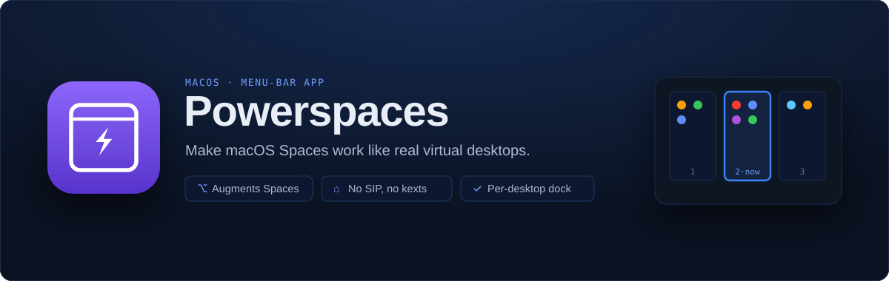

<!-- site-nav -->

  <a href="README.md"><b>Powerspaces</b></a> &nbsp;·&nbsp;
  <a href="user-guide.md">User guide</a> &nbsp;·&nbsp;
  <a href="user-guide-extensive.md">Full guide</a> &nbsp;·&nbsp;
  <a href="getting-started.md">Getting started</a> &nbsp;·&nbsp;
  <a href="cli.md">CLI</a> &nbsp;·&nbsp;
  <a href="https://ko-fi.com/sebastianpdw">♥ Support</a> &nbsp;·&nbsp;
  <a href="https://powerspaces.app">Website ↗</a>

# Powerspaces docs

  

Documentation for **Powerspaces**, a lightweight macOS menu-bar app that makes
native Spaces work like real virtual desktops by fixing the launch/activation
leaks in the Dock and launchers.

## Start here

- **[User guide](user-guide.md)**: the short version covering what it does, how to install
  it, and the handful of things worth knowing. Read this first.
- [Extensive user guide](user-guide-extensive.md): every feature, every
  preference, strategies, troubleshooting, and the FAQ.
- [Getting started](getting-started.md): the quick install, plus building from
  source and running the tests (for developers).
- [CLI reference](cli.md): the `powerspaces` command for smart-launch, pinning,
  configuration, and the Raycast hook, from your shell.
- [Design principles](design-principles.md): the three rules the app is built to,
  lightweight, minimal, and modular.
- [Changelog](changelog.md): what changed in each release, including macOS 27
  support, and what has been verified on which macOS version.

## The four problems it targets

| # | Problem | Status |
|---|---|---|
| 1 | Dock icon for an app on another Space yanks you away | ✅ smart-launch |
| 2 | A launcher activates the other-Space instance, not here | ✅ smart-launch + App Launcher (or the Raycast extension, if you use Raycast instead of Spotlight) |
| 3 | The Dock is global, not per-Space | ✅ per-Space dock |
| 4 | Cmd-Tab is global across all Spaces | ✅ AltTab integration (one-click active-Space filter) |
