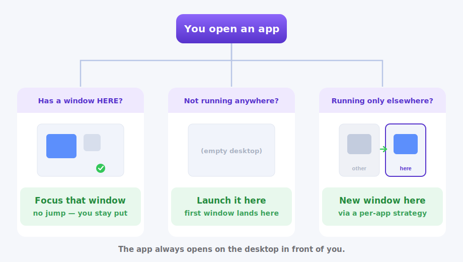
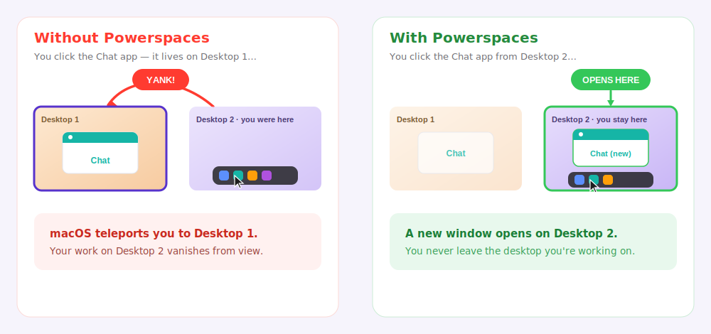
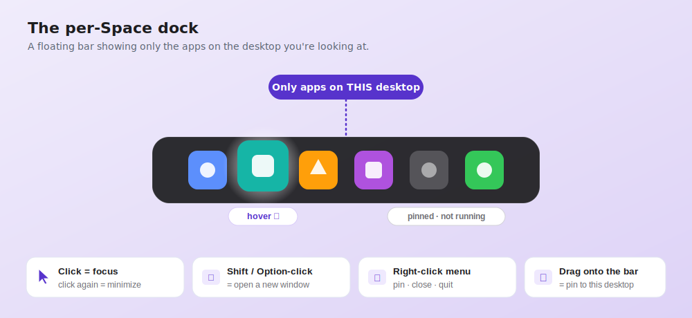
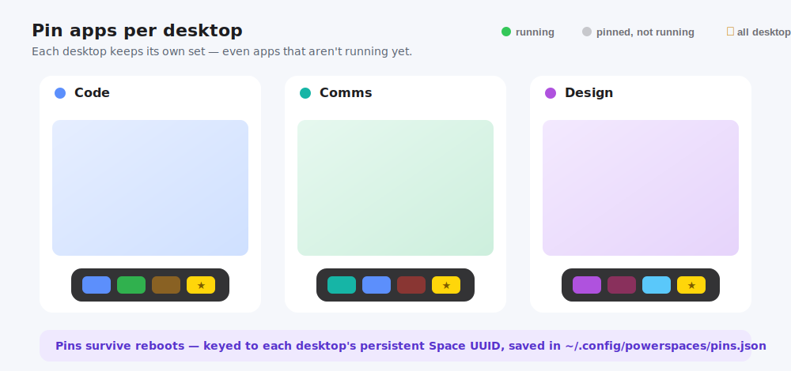
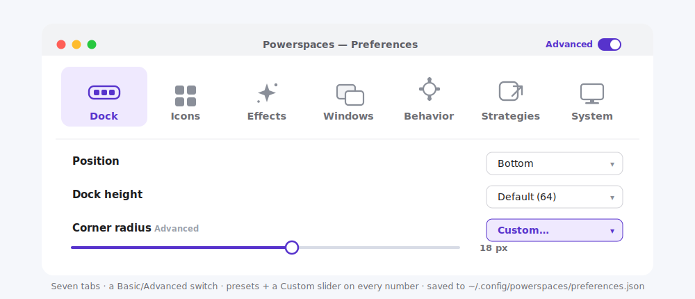

# Powerspaces: Extensive User Guide

<p align="center">
  
</p>

**Make macOS Spaces feel like real virtual desktops.**

> In a hurry? The short **[User guide](user-guide.md)** covers the essentials in a
> couple of minutes. This page is the complete reference, covering every feature,
> every preference, and the fine print.

If you came to the Mac from Windows, you probably love the idea of virtual
desktops but hate how leaky they feel on macOS: you click an app in the Dock and
get *yanked* to whatever desktop it happens to live on. You search an app in
Spotlight and, same thing, you're teleported away from the work in
front of you. The Dock shows *every* app, not the ones on the desktop you're
looking at. And Cmd-Tab cycles through windows scattered across every Space.

**Powerspaces fixes all of that**, without replacing the macOS features you
already like. Your swipe gestures, Mission Control, and native Spaces all keep
working exactly as before. Powerspaces simply *augments* them so each desktop
finally behaves like its own isolated workspace, the way Windows virtual desktops
do.

It's a tiny, fast, native menu-bar app. No SIP changes. No kernel extensions. No
screen recording. Just the focused, per-desktop Mac you always wanted.

---

## Table of contents

**Get going**

1. [What Powerspaces does](#what-powerspaces-does)
2. [How it thinks: smart-launch](#how-it-thinks-smart-launch)
3. [Installing Powerspaces](#installing-powerspaces)

**The features**

4. [The per-Space dock](#the-per-space-dock)
5. [Pinning apps to a desktop](#pinning-apps-to-a-desktop)
6. [The App Launcher](#the-app-launcher)
7. [Per-desktop Cmd-Tab (AltTab)](#per-desktop-cmd-tab-alttab)
8. [Raycast extension (experimental)](#raycast-extension-experimental)
9. [The command line](#the-command-line)

**Settings & reference**

10. [Preferences: every setting explained](#preferences-every-setting-explained)
11. [Launch strategies](#launch-strategies)
12. [Permissions](#permissions)

**Help**

13. [Good to know (limitations)](#good-to-know-limitations)
14. [Troubleshooting](#troubleshooting)
15. [FAQ](#faq)

---

## What Powerspaces does

Powerspaces targets the four leaks that stop native Spaces from feeling like true
virtual desktops:

| # | The problem | What Powerspaces does |
|---|---|---|
| 1 | **Dock yank**: clicking a Dock icon for an app on another desktop jumps you away | Smart-launch: focuses the app *here*, or opens a fresh window *here*, and never jumps you |
| 2 | **Launcher yank**: Spotlight (or any launcher) jumps you to the app's other-desktop copy | The built-in **App Launcher**, or the **[Raycast extension](#raycast-extension-experimental)**, opens any app right *here*, never jumping you |
| 3 | **Global Dock**: the Dock shows every app, not just this desktop's | A per-Space dock that shows only the apps with a window on the desktop you're on |
| 4 | **Global Cmd-Tab**: Cmd-Tab cycles every Space's windows | A one-click **AltTab** install: Powerspaces detects/installs AltTab and sets its active-Space filter; a quick manual step in AltTab then makes ⌘-Tab the trigger (see [Per-desktop Cmd-Tab](#per-desktop-cmd-tab-alttab)) |

The headline feature is **"focus-if-here, else new-window-on-the-current-desktop,
never jump away."** That single behavior is what turns macOS Spaces from
loosely-grouped windows into genuinely isolated desktops.

And because Powerspaces only *reads* window/Space information (the same read-only
path the popular AltTab app uses), it needs **no SIP changes** and never moves
your windows behind your back.

<p align="center">
  
</p>

---

## How it thinks: smart-launch

Every time you open an app through Powerspaces (by clicking the dock, picking it
from the App Launcher, or running the CLI), it makes one simple, predictable
decision based on a snapshot of your windows and Spaces:

| Situation | What happens |
|---|---|
| The app has a window **on the desktop you're on** | **Focus** that exact window. No jump. |
| The app **isn't running at all** | **Launch** it, and its first window lands on the current desktop. |
| The app is running **only on other desktops** | Open a **new window** right here, using a per-app strategy (see [Launch strategies](#launch-strategies)). |

That's it. The behavior is consistent, so you always know where an app will
appear: **on the desktop in front of you.**

<p align="center">
  
</p>

And here's what that feels like in practice, with no more teleporting:

<p align="center">
  
</p>

---

## Installing Powerspaces

Powerspaces builds from source with the Swift toolchain. You don't need full
Xcode, since Apple's **Command Line Tools** is enough:

```sh
xcode-select --install   # only if `swift --version` fails
```

Then clone the repo and pick the install that fits you.

### Install the app (recommended)

For almost everyone, the **Powerspaces.app** menu-bar dock is all you need:

```sh
./scripts/install-app.sh
```

Then launch the app:

```sh
open /Applications/Powerspaces.app
```

Powerspaces lives in your menu bar (look for the white **power-window** glyph,
a little window frame with a lightning bolt) and as a proper app with its own
Dock icon and the name **Powerspaces**. Prefer a plain text glyph? You can switch
it to **▣ / ▢ / ⧉**, or hide it entirely, in Preferences → System.

### Also want the `powerspaces` CLI?

The CLI just lets you drive smart-launch from the shell or scripts. **You don't
need to install it yourself for Raycast**: the in-app **Set Up Raycast
Extension…** flow installs it for you (see
[Raycast extension](#raycast-extension-experimental)). To put it on your PATH
directly, build the release binary and copy it:

```sh
swift build -c release
sudo cp .build/release/powerspaces /usr/local/bin/powerspaces
```

The app installer respects overrides so you can install without `sudo`, and you can
copy the CLI to a prefix you own:

```sh
APP_DEST="$HOME/Applications" ./scripts/install-app.sh        # app, no sudo
cp .build/release/powerspaces "$HOME/.local/bin/powerspaces"  # CLI, no sudo
```

### Just trying it out

You can run everything straight from the source tree without installing:

```sh
swift build -c release          # build
swift run PowerspacesApp        # run the dock/menu-bar app
swift run powerspaces decide Spotify   # see a smart-launch decision (no action)
```

> **Tip:** `swift run PowerspacesApp` runs an *unbundled* binary, so macOS shows a
> generic "exec" icon and label. Use `./scripts/install-app.sh` (or
> `./scripts/make-app.sh`) to get the real Powerspaces icon and name.

For building from source and running the tests, see
[Getting started](getting-started.md).

---

## The per-Space dock

Launch Powerspaces and a sleek floating bar appears at the bottom-center of your
screen. Unlike the native Dock, it shows **only the apps that have a window on the
desktop you're currently looking at**, and it updates instantly as you swipe
between Spaces. Finally, a Dock that reflects *this* workspace.

For the full effect, set the **native Dock to auto-hide** (System Settings →
Desktop & Dock → "Automatically hide and show the Dock") so the Powerspaces bar
becomes your everyday, per-desktop dock.

<p align="center">
  
</p>

### Using the dock

- **Click an icon** brings that app's window on this desktop to the front.
- **Click again** (when it's already frontmost) minimizes it. A natural toggle.
- **Click an app that isn't open here** to smart-launch it onto the current
  desktop (no jump).
- **Shift- or Option-click** forces a brand-new window (configurable; see
  Preferences → Behavior).
- **Hover** and the icon magnifies with a smooth highlight (fully customizable, or
  turn it off).
- **Drag an app onto the bar** to pin it to the current desktop (see below).
- **App Launcher tile:** turn it on in Preferences → Windows to add a
  Launchpad-style tile that opens a searchable grid of *every* installed app (see
  [The App Launcher](#the-app-launcher)).
- **Right-click an icon** to open a context menu with per-app actions:
  - **Open new window**
  - **Pin to this desktop** / **Unpin from this desktop**
  - **Pin to all desktops** / **Unpin from all desktops**
  - When an app is **pinned to all desktops**, the *this desktop* item becomes
    **Unpin (this desktop)**, which hides the app on the current desktop only, while
    leaving it pinned on every other desktop. Pick **Pin (this desktop)** to bring
    it back here. (A hidden app reappears in the menu only while it's running on
    this desktop, or once you re-pin it.)
  - **New-window strategy** sets *how* to make a window (advanced; see
    [Launch strategies](#launch-strategies))
  - **When open elsewhere** sets *what to do* when the app is already open on
    another desktop:
    - **Open a new window**, the default, gives you a fresh window here. For the
      single-instance apps it reads **Open a new window (experimental)**; see
      [Troubleshooting](#troubleshooting).
    - **Show a warning** just flashes a banner and doesn't touch the other window
    - **Quit there, reopen here** quits the app entirely and relaunches it on this
      desktop. The one reliable way to bring a stubborn single-window app here, but
      it loses anything unsaved or playing, so it confirms first.
  - **Close on this desktop** closes just this desktop's windows of the app
    (needs Accessibility)
  - **Quit (all desktops)** quits the app entirely

### The menu-bar item

The **power-window** glyph in the menu bar (or the text glyph / hidden item you've
chosen instead) gives you quick access to the most common toggles without opening
Preferences:

- **Refresh Dock** (⌘R) forces an immediate re-scan
- **Preferences…** (⌘,) opens the settings window
- **Show App Launcher** toggles the App Launcher tile on the bar (✓ when on)
- **Hide macOS Dock** toggles whether Apple's Dock stays hidden (✓ when on)
- **Faster Desktop Switch** is a submenu mirroring the Preferences section; it
  toggles the **Swipe (four-finger)** and **Keyboard shortcut** instant-switch
  overrides on or off (✓ when on)
- **Hide Menu-Bar Icon** removes this glyph from the menu bar (you can still get
  back to Preferences by right-clicking the dock → *Open Preferences*)
- **Reset Accessibility Permission…** clears a stale Accessibility grant (handy
  after rebuilding or reinstalling) and relaunches to grant it fresh
- **Quit Powerspaces**

---

## Pinning apps to a desktop

Pinning is what makes a desktop *yours*. Pin Slack to your "comms" desktop and
your editor to your "code" desktop, and those apps will always show in that
desktop's dock (**even when they aren't running**), fully isolated, per desktop,
and saved across reboots.

<p align="center">
  
</p>

- A pinned app that isn't running shows as a plain icon; click it to launch it on
  the current desktop. Running apps are framed with a colored outline by default
  (the **Box running** indicator) so you can spot what's already open. (Prefer to
  fade the idle pins instead? Switch the **Running indicator** to **Dim not-running**
  in Preferences → Icons.)
- Each desktop can pin its own set. Pin Slack here, pin Figma there, and they don't
  bleed into each other.
- **Pin to all desktops** puts an app on *every* desktop's dock, now and in the
  future, which is perfect for things you always want one click away.

Pins are keyed to each desktop's **persistent Space UUID**, so they survive
reboots. They're stored in a plain, human-readable file at
`~/.config/powerspaces/pins.json` (all-desktops pins live under `everywhere`).

You can also pin from the [command line](cli.md#pinning-from-the-shell), which is
handy for scripting.

---

## The App Launcher

The per-Space dock deliberately shows only what's *on this desktop*. But sometimes
you want to reach for an app that isn't pinned or open anywhere, without falling
back to the native Dock or Launchpad. That's the **App Launcher**.

Turn it on in **Preferences → Windows → App Launcher** ("Show the App
Launcher"). A tile with a 3×3 "all apps" grid icon appears on the bar, **leftmost
by default, and you can drag it anywhere** in the bar like any other icon.

**Click the tile** and a Spotlight-style panel opens in the center of the screen:

- A **search field** is focused and ready, so just start typing to filter by name.
- Below it, a scrollable **grid of every installed app** (your `/Applications`,
  Utilities, `~/Applications`, and the system apps), sorted alphabetically.
- **Click an app** to launch it. Because it routes through smart-launch, it
  opens **on the desktop you're on**, never jumping you away. The panel closes
  itself afterward.
- **Arrow keys** move the selection around the grid; **Return** launches the
  selected app (just type "fig", hit Return, done).
- **⌘Return** (or **⌘-click**) opens the app in a **brand-new window** instead of
  focusing an existing one.
- **Drag an app from the grid onto the bar** to pin it to the current desktop (the
  panel stays open so you can pin several in a row).
- **Escape**, or a click anywhere outside the panel, dismisses it.

To remove the tile again, either turn the toggle back off in Preferences, or
**right-click the tile → Hide App Launcher**. (Right-click → *Open App Launcher*
opens it without a click, too.)

The app list is scanned freshly each time you open the launcher, using a plain,
fast folder scan with no Spotlight indexing or background work, so it costs nothing
while the panel is closed.

---

## Per-desktop Cmd-Tab (AltTab)

macOS ⌘-Tab cycles windows from **every** Space at once. It's the one Spaces leak
that isn't about launching. Rather than reimplement the system app switcher (a
fragile event tap that would fight other switchers and hijack a shortcut everyone
relies on), Powerspaces leans on **[AltTab](https://alt-tab.app)**, a free,
open-source, best-in-class switcher, and configures it to scope to the current
desktop.

### Install AltTab

AltTab is a separate app you install once. Either:

- **From Powerspaces:** open **Preferences → System → Per-desktop Cmd-Tab (AltTab)**.
  If you have Homebrew, click **Install with Homebrew** to run
  `brew install --cask alt-tab` in a Terminal window. If not, the button is
  **Get AltTab**, which opens the download page.
- **Homebrew (by hand):** `brew install --cask alt-tab`
- **Direct download:** grab it from <https://alt-tab.app> (or its
  [GitHub releases](https://github.com/lwouis/alt-tab-macos/releases)).

On first launch AltTab asks for **Accessibility** (and, only if you want window
thumbnails, **Screen Recording**). That's AltTab's own grant, separate from the one
Powerspaces uses.

### Configure it for Powerspaces

Back in **Preferences → System → Per-desktop Cmd-Tab (AltTab)**, once AltTab is
detected (a green ✓ and its version appear), click **Configure AltTab with
Powerspaces**. It sets AltTab to **show only the windows on the desktop you're on**
(the active Space), then quits and relaunches AltTab to apply it.

Then do the **one manual step** that makes ⌘-Tab the trigger. AltTab stores its
shortcuts in a format only it can write, so Powerspaces can't set it for you:

> **AltTab → Settings → Controls → set the hold shortcut to ⌘.**

AltTab disables the system ⌘-Tab for you when you do. (The success dialog has an
**Open AltTab** button to jump straight there.) Now press **⌘-Tab** and you'll only
see the apps on the current desktop.

### Or set it all by hand

The Configure button only writes the space filter (a simple value); the trigger is
always manual. Both settings live in **AltTab → Settings → Controls**:

1. **Show windows from** → **Active Space**
2. **Hold shortcut** → **⌘** (so ⌘-Tab triggers AltTab instead of the macOS switcher)

The space filter is **best-effort** even via the button (a future AltTab could
rename or reorder that setting), so this manual route is the durable fallback.

### Good to know

- **It's a separate app.** AltTab sits in your menu bar alongside Powerspaces, with
  its own permissions and updates: the trade-off for not reinventing a polished
  switcher.
- **Why the trigger is manual.** AltTab keeps its keyboard shortcuts as an archived
  object, not a plain setting, so it can't be written reliably from outside AltTab.
  The space filter *is* a plain value, which is why the button can set that part.
- **Prefer to keep the macOS ⌘-Tab?** AltTab's own default trigger is ⌥-Tab. Skip the
  hold-shortcut step and you get a per-desktop switcher on ⌥-Tab while ⌘-Tab stays
  native.


---

## Raycast extension (experimental)

Everything above works with no extra tools. As a bonus, Powerspaces also ships an
**experimental** Raycast extension. It wires smart-launch into Raycast, so when you
search for an app there it opens **on the desktop you're on** instead of teleporting
you to wherever it already runs. It's the same thing the built-in
[App Launcher](#the-app-launcher) does, but from your Raycast search bar.

**Set it up from the app (easiest).** In **Preferences → System → Raycast
(experimental)**, click **Set Up Raycast Extension…**. It checks for the
`powerspaces` CLI and Node.js (with a **Get Node.js** button if `npm` is missing),
installs the CLI, copies the bundled extension to
`~/.config/powerspaces/raycast-extension/`, and opens Terminal **once** to run
`npm install` and import the extension. It runs on its own and stops when it shows
the `✅ DONE, safe to close` box, and then you close the window (⌘W). You'll need
the **Raycast app** and **Node.js** installed.

**Or set it up by hand.** Build and install the CLI (`swift build -c release`, then
copy `.build/release/powerspaces` onto your `PATH`), then add the extension from
`raycast-extension/`. If the CLI lives somewhere other than `/usr/local/bin`, point
`POWERSPACES_BIN` at it.

**Using it.** Run **"Open on Current Space"** in Raycast and type an app name, then
press **⏎** to open it on the current desktop. Give the command the alias `o` (or a
hotkey like ⌘⌥O) to jump straight in, and press **⌘N** ("Open New Window Here") on a
highlighted app to force a brand-new window on this Space.

It's experimental, so treat it as a bonus; the built-in App Launcher covers the
same search-and-launch need with no setup. **Preferences → System → Raycast** in
the app walks you through the rest of the setup.

---

## The command line

The `powerspaces` CLI runs the same smart-launch from your shell, handy for
scripting or a quick check.

```sh
powerspaces decide <app>             # show what would happen (no action taken)
powerspaces open   <app>             # do it (smart-launch)
powerspaces open   <app> --new       # force a brand-new window
powerspaces list-windows [--all]     # apps on this desktop (or all, with Space ids)
```

`<app>` is a display name (`Firefox`) or a bundle id (`org.mozilla.firefox`).

> The **full reference** (install, every command, pinning, configuration, and
> environment overrides) lives in the **[CLI reference](cli.md)**.

---

## Preferences: every setting explained

Open Preferences from the menu-bar icon (**power-window glyph → Preferences…**, or
**⌘,**), or right-click the dock → *Open Preferences*. Settings are organized into
seven tabs: **Dock, Icons, Effects, Windows, Behavior, New windows, System**.

A small **Advanced** switch sits at the top-right. Leave it **off** (Basic) and
each tab shows just the everyday controls; flip it **on** to reveal every
fine-tuning option (colors, speeds, widths, niche settings). All seven tabs stay
visible either way. Every numeric setting offers handy presets *plus* a
**Custom…** option that reveals a fine-grained slider, and every control has a
built-in tooltip.

Your settings live in plain, human-readable files in `~/.config/powerspaces/`
(`preferences.json` for appearance/behavior, `config.json` for strategies). That
means **your settings survive app reinstalls** and don't depend on the app's
bundle id.

<p align="center">
  
</p>

> Settings tagged **(Advanced)** below show up only when the **Advanced** switch is on.

### 1. Dock

The geometry of the bar itself, its optional border, and its auto-hide.

**Layout**

| Setting | What it does |
|---|---|
| **Position** | Which screen edge the bar sits on: **Bottom**, **Top**, **Left**, or **Right** (vertical edges stack icons top-to-bottom). |
| **Material / blur** | The bar's translucency: **HUD** (default), **Darker**, **Lighter**, or **Solid**. |
| **Dock height** | How thick the bar is. The smallest setting hugs the icons exactly; larger values pad around them (Snug / Default 64 / Tall / Taller, or custom). |
| **Corner radius** *(Advanced)* | How rounded the corners are (Square / Rounded / Pill, or custom 0–40 px). |
| **Gap from screen edge** *(Advanced)* | Distance between the bar and the screen edge (Flush / Default / Far, or custom 0–100 px). |

**Outline** *(Advanced)* is an optional border drawn around the *whole* bar, separate from the running-app box.

| Setting | What it does |
|---|---|
| **Dock outline** | Thickness of the border (None leaves the bar borderless). |
| **Dock outline color** | The color of that border (appears once the outline has width). |

**Auto-hide** tucks the *Powerspaces* bar off its screen edge when you're not using it; on by default.

| Setting | What it does |
|---|---|
| **Hide the dock automatically** | Master switch. When on, the bar tucks away after the pointer leaves it. |
| **Animation** *(Advanced)* | How it hides and reveals: **Slide off edge** (default), **Fade**, or **Slide + fade**. |
| **Hide after** *(Advanced)* | How long the pointer must be away before it hides: **Instant**, **Short (0.5s)**, **Default (1s)**, **Long (2s)**, or custom. |
| **Hide speed** *(Advanced)* | How long the hide animation takes (**Instant** snaps it away). |
| **Show speed** *(Advanced)* | How long the reveal animation takes (**Instant** shows it immediately). |

When auto-hide is on, bring the bar back by moving the pointer to the screen edge
it lives on: the **bottom** edge for a bottom bar, the **left** edge for a left
bar, and so on (it follows the **Position** above). Reveal works anywhere along
that edge. This is Powerspaces' own auto-hide, separate from (and not the same
as) the native macOS Dock's.

### 2. Icons

The app icons on the bar: their size, spacing, and how a running app is marked.

**Size & spacing**

| Setting | What it does |
|---|---|
| **Icon size** | How big each app icon is (Small 36 / Medium 48 / Large 64, or custom 24–120 px). |
| **Icon spacing** | The gap between icons (None / Tight / Default / Roomy, or custom 0–40 px). |

**Running indicator** controls how a running app is told apart from a pinned-but-not-running shortcut: **Box running** (default) frames each running app with a colored outline and leaves everyone at full opacity; **Dim not-running** instead fades the idle pins.

| Setting | What it does |
|---|---|
| **Running indicator** | Pick **Dim not-running** or **Box running**. |
| **Dim pinned / not-running** *(Advanced, Dim mode)* | Opacity of pinned apps that aren't running, where lower is fainter (Off / Default 55% / Faint 35%). |
| **Outline gap** *(Advanced, Box mode)* | How far the running-app outline floats out from the icon (Snug 0 / Default 3 / Roomy 6, or custom 0–20 px). |
| **Outline width** *(Advanced, Box mode)* | How thick the outline is (Thin 1 / Default 2 / Thick 3, or custom 0–8 px). |
| **Outline color** *(Advanced, Box mode)* | The color of the outline drawn around each running app (defaults to dark grey). |
| **Highlight color** *(Advanced, Box mode)* | The color tinting the inside of each running app's box, kept translucent so the icon stays legible (defaults to light grey). |

### 3. Effects

Motion and feedback: the hover magnify, and the animation when an icon joins or leaves the bar.

**Hover**

| Setting | What it does |
|---|---|
| **Enable hover effect** | Master switch for the magnify + highlight when you point at an icon. |
| **Magnification** *(Advanced)* | How much an icon grows on hover (Off 1.0× up to Big 1.3×, or custom up to 2.0×). |
| **Highlight** *(Advanced)* | Opacity of the highlight behind a hovered icon (None / Default 16% / Stronger 28%). |
| **Animation speed** *(Advanced)* | How long the hover effect takes (Instant / Default 0.12s / Slow 0.2s). |

**Icon animation** plays when an app joins or leaves the dock (not when you switch desktops, where the whole list changes at once). Style and speed are shared by both directions.

| Setting | What it does |
|---|---|
| **Animate when an app is added** | Grow the bar to open a slot and let the new icon appear (launched, pinned, or its first window opens here). |
| **Animate when an app is removed** | Play the icon out and shrink the bar to close the gap (quit, unpinned, or its last window here closes). |
| **Style** *(Advanced)* | How the icon appears/disappears: **Fade out**, **Shrink** (default), **Poof (grow & fade)**, or **Slide off edge**. |
| **Speed** *(Advanced)* | How long each beat (slot open/close + icon appear/disappear) takes (Instant / Fast 0.12s / Default 0.18s / Slow 0.3s, or custom up to 0.8s). |

### 4. Windows

Make the dock behave more like the Windows taskbar, and toggle the App Launcher tile.

**Windows**

| Setting | What it does |
|---|---|
| **Show an icon per open window** | An app with two windows on this desktop appears twice. |
| **Show window titles (wide items)** | Each window becomes a wider item labeled with its live title (read via Accessibility; for a browser, that's the page title, since the literal URL isn't available). |
| **Show titles for** *(Advanced)* | **All apps**, or **only apps with multiple windows** open here. |
| **Title text color** *(Advanced)* | The color of the window-title text. |
| **Window item width** *(Advanced)* | How wide each labeled window item is (Compact / Default / Wide, or custom 80–400 px). |

**App Launcher**

| Setting | What it does |
|---|---|
| **Show the App Launcher** | Adds a Launchpad-style tile to the bar that opens a searchable grid of every installed app (on by default). See [The App Launcher](#the-app-launcher). |
| **Icon color** *(Advanced)* | Base color of the launcher tile (its subtle gradient is derived from this). |
| **Outline color** *(Advanced)* | Color of the ring drawn around the selected app in the launcher. |
| **Highlight color** *(Advanced)* | Color filling the selected app's tile; keep it translucent so the icon shows through. |

### 5. Behavior

Clicks, close-to-quit, performance, desktop switching, and warning banners.

**Clicks**

| Setting | What it does |
|---|---|
| **Middle-click action** | What clicking a dock icon with the middle mouse button does: **Open a new window** (default), **Quit (this desktop)**, **Quit (all desktops)**, **Close this window**, or **Do nothing**. |
| **Force new window with** *(Advanced)* | Which modifier forces a brand-new window on click: **Shift or Option**, **Shift only**, or **Option only**. |

**Closing windows (experimental)**

| Setting | What it does |
|---|---|
| **Quit an app when its last window closes** | Close-to-quit: closing an app's *last* window quits the app instead of leaving it running with no windows, so it stops background copies piling up when you summon an app to many desktops (e.g. Claude), leaves ⌘-Tab, and frees memory. Acts per app instance; minimising never quits. **Experimental and off by default**, since it overrides an app's own behaviour and can discard unsaved work. |

**Performance** *(Advanced)*

| Setting | What it does |
|---|---|
| **Refresh interval** | How often the dock re-scans windows. Lower is snappier but uses a touch more CPU (**Immediate 0.1s, the default** / Snappy 1s / Default 2s / Easy 5s, or custom 0.1–10s). |

**Desktop switching**

| Setting | What it does |
|---|---|
| **Faster desktop switch → Swipe (four-finger)** | Make the trackpad swipe between desktops *instant* by skipping macOS's slide animation. Your swipe is intercepted and replaced with an immediate jump in the same direction; the gesture itself is unchanged, it just lands at once. **Off by default.** Needs Accessibility. |
| **Faster desktop switch → Keyboard shortcut** | Same, but for your **“Move left/right a space”** keyboard shortcut. It adopts *whatever you've bound* (e.g. ⌘⌥←/→) and makes it instant by temporarily disabling the system shortcut while Powerspaces runs (restored when you turn this off or quit). Independent of the swipe toggle. **Off by default.** Needs Accessibility. |

**Faster desktop switch** removes the wait when you move between desktops. macOS
normally plays a slide animation on every space switch (it's even longer on
high-refresh displays); with this on, your usual swipe or shortcut still triggers
the switch but it lands **instantly**, with no slide. There are two independent
toggles:

- **Swipe (four-finger)** intercepts the horizontal space-switch swipe and posts
  an immediate switch in its place; you keep your normal gesture, only the
  animation goes away.
- **Keyboard shortcut** does the same for your **“Move left/right a space”**
  shortcut. It reads whatever you've bound it to (e.g. ⌘⌥←/→) and takes it over by
  *temporarily disabling the system shortcut* while Powerspaces runs, firing the
  instant switch instead. It's restored automatically when you turn the toggle off
  or quit Powerspaces. (If Powerspaces ever crashes while this is on, the shortcut
  is restored on the next launch.) **If you later change that shortcut, restart
  Powerspaces so it picks up the new keys.**

Both are **off by default**, need **Accessibility** (grant it if prompted, then
relaunch), and use private macOS APIs, so they can occasionally need a tweak
after a macOS update; just turn them off if anything looks off. The instant-switch
technique is adapted from
[InstantSpaceSwitcher](https://github.com/jurplel/InstantSpaceSwitcher) (MIT).

> This is separate from the brief lag some apps show *after* a switch before they
> accept typing. That's macOS App Nap waking the app back up, not the switch
> animation, so Faster desktop switch won't change it.

**Warnings:** some apps can't open a second window on the current desktop (see
[Launch strategies](#launch-strategies)); when that happens Powerspaces can show a
gentle banner instead of silently jumping you.

| Setting | What it does |
|---|---|
| **Show warning banners** | The master switch for the "⚠︎ already open on another desktop" banner. |
| **Stays up for** *(Advanced)* | 2s / Default 4s / 6s / **Until clicked** / Custom (1–60s). |
| **Position** *(Advanced)* | Where the banner appears: **Top**, **Bottom**, or **Center**. |

### 6. New windows

Sets the default new-window strategy for unknown apps, and (in Advanced)
**Show a warning** vs. **Quit there and reopen here** per single-window app. See
the next section for the full story.

### 7. System

macOS-level integration, the optional launcher setups, and app management.

**macOS Dock**

| Setting | What it does |
|---|---|
| **Hide the macOS Dock** | Force Apple's built-in Dock to stay hidden so the Powerspaces bar can stand in for it, with no fiddling with System Settings → Dock yourself. The Dock *process* keeps running (Mission Control and ⌘-Tab still work); it just never slides into view. Turning this off, or quitting Powerspaces, brings the Dock back; it re-hides on the next launch while the setting stays on. |

**Raycast (experimental):** search any app in Raycast and open it on the desktop
you're on. **Install CLI** adds the `powerspaces` command (to `~/.local/bin`, no
admin); **Set Up** also imports the bundled extension (it needs the Raycast app and
Node.js). See [Raycast extension (experimental)](#raycast-extension-experimental)
for the full walkthrough.

**Per-desktop Cmd-Tab (AltTab):** detect/install [AltTab](https://alt-tab.app) and
one-click-set its active-Space filter; a one-time step in AltTab then makes ⌘-Tab
show only the current desktop's windows. See
[Per-desktop Cmd-Tab (AltTab)](#per-desktop-cmd-tab-alttab) for the full walkthrough.

**General**

| Setting | What it does |
|---|---|
| **Menu-bar icon** *(Advanced)* | The glyph in the menu bar: **Power window (icon)** (the drawn icon, default), **Dashed square**, **Empty square**, **Overlapping squares**, **Invisible (clickable)** (blank but still clickable), or **Hidden (no icon)** (removed entirely). |
| **Launch at login** | Start Powerspaces automatically when you log in. *(Requires the bundled `.app`; install it with `install-app.sh`.)* |
| **Reset Accessibility permission** *(Advanced)* | Clear a stale macOS Accessibility grant (common after rebuilding or reinstalling the app) and relaunch so you can grant it fresh. |
| **Quit Powerspaces** | Quit the app. If you've hidden the macOS Dock, it returns when Powerspaces quits. |

**Uninstall**

| Setting | What it does |
|---|---|
| **Uninstall Powerspaces** | Removes Powerspaces and the `powerspaces` CLI from your Mac, then quits; you choose whether to keep or delete your settings. Apple's Dock and your space-switch shortcut are restored on quit. If you set up the Raycast extension, also remove **Powerspaces** from Raycast's own Extensions list (it was imported in developer mode and can't be removed from here). |

---

## Launch strategies

Here's the one honest caveat worth understanding. Opening a *fresh window of an
already-running app* on the current desktop is something macOS only allows for
*some* apps. Powerspaces handles each app with the best available strategy, and
you can override any of them.

| Strategy | What it does | Best for |
|---|---|---|
| `openArgs` | Runs the app binary with arguments like `--new-window` | Browsers / Electron (Firefox, Chrome, VS Code) |
| `newInstance` | `open -n -a` to force a second instance | Genuinely multi-instance apps |
| `appleScript` | Runs the app's own "make new window" script | Finder, Safari, terminals |
| `warn` | Shows a small banner; doesn't move or close anything | Single-window apps that can't get a second window (Messages, System Settings, Music, Mail) |
| `quitReopen` | Quits the app entirely and relaunches it here (so a fresh window lands on this desktop) | Single-window apps you want *on* this desktop, accepting that unsaved/transient state is lost (e.g. System Settings) |
| `cmdN` | Activates the app and synthesizes ⌘N | Last resort |
| `focusOnly` | Activates the existing instance and accepts the jump | When you'd rather just switch desktops |

**The honest part:** truly single-instance apps (Messages, System Settings, many
Mac App Store / Electron apps) *cannot* be given a second window by any app, and
there's no reliable way to drag their existing window over from another desktop
(the Accessibility API can't act on a window sitting on an inactive Space). So they
default to a `warn` banner; switch desktops to reach the window. If you'd rather
force one onto your current desktop, `quitReopen` quits and relaunches it here
(losing anything unsaved or playing). Browsers and editors, on the other hand,
work beautifully.

### Editing strategies from the Preferences UI

The **New windows** tab sets the default strategy for unknown apps, and (in
Advanced) lets you pick **Show a warning** or **Quit there and reopen here** for
each single-window app. For any app, you can also right-click its icon →
**When open elsewhere** and **New-window strategy**.

### Editing strategies from `config.json`

For full control, copy the example config and edit it:

```sh
mkdir -p ~/.config/powerspaces
cp config.example.json ~/.config/powerspaces/config.json
```

Your entries override the built-in defaults; any app not listed uses
`defaultStrategy` (which itself defaults to `newInstance`). Example:

```json
{
  "defaultStrategy": "newInstance",
  "apps": [
    { "bundleID": "org.mozilla.firefox", "strategy": "openArgs", "args": ["--new-window"] },
    { "bundleID": "com.apple.Safari", "strategy": "appleScript",
      "appleScript": "tell application \"Safari\" to make new document" },
    { "bundleID": "com.apple.MobileSMS", "strategy": "warn" },
    { "bundleID": "com.apple.systempreferences", "strategy": "warn" },
    { "bundleID": "com.apple.mail", "strategy": "warn" }
  ]
}
```

---

## Permissions

Powerspaces asks for as little as possible. **In practice only Accessibility is
required**: Screen Recording is never used, and SIP is never touched.

| Permission | Needed? | Why |
|---|---|---|
| **Accessibility** | **Yes** | To raise the exact window and close per-desktop windows. Grant it in System Settings → Privacy & Security → Accessibility, then relaunch. (Per-desktop Cmd-Tab is handled by AltTab, which asks for its *own* Accessibility grant.) |
| **Automation** | Only sometimes | Only for apps using the `appleScript` strategy, the first time each is used. |
| **Screen Recording** | **No** | The dock uses app identity, not window titles or thumbnails. |

> Because Powerspaces uses private (read-only) macOS APIs, it can't be sandboxed
> or shipped on the App Store — but that doesn't block notarization (a malware
> scan, not App Review). The Homebrew release is **Developer-ID signed and
> notarized**, so it installs with no Gatekeeper warning.

---

## Good to know (limitations)

Powerspaces is upfront about what macOS does and doesn't allow. None of these are
bugs; they're the real constraints the design works within:

- **New windows are app-dependent.** Browsers, editors, Finder, and Safari get a
  fresh window on the current desktop flawlessly. Genuinely single-instance apps
  (Messages, System Settings) can't; for those you choose how Powerspaces reacts:
  **show a warning**, **move the window here** (when the app supports it), or **quit
  it on the other desktop and reopen it here**.
- **It can't tell which *other* desktop a window is on.** macOS only reports Space
  membership for the *current* desktop. This doesn't affect smart-launch ("is it
  here?" and "is it running anywhere?" both work perfectly); it just rules out a
  full "all Spaces" map.
- **The dock polls.** macOS doesn't post notifications for every window
  open/close, so the dock refreshes on a timer (default 0.1s, the *Immediate*
  preset) in addition to Space/app events. It's cheap, and you can dial it back
  to save CPU.
- **Multi-monitor** edge cases are lightly handled in this version; "current
  Space" is resolved relative to the display that owns the menu bar.
- **Per-desktop Cmd-Tab is delegated to AltTab.** Rather than reimplement the
  macOS app switcher, Powerspaces detects/installs [AltTab](https://alt-tab.app) and
  one-click-sets its active-Space filter; making ⌘-Tab the trigger is a guided
  one-time step in AltTab's own settings (see
  [Per-desktop Cmd-Tab](#per-desktop-cmd-tab-alttab)). AltTab is a separate app with
  its own permissions, and even the filter write is best-effort (the manual setting
  is the durable fallback).

---

## Troubleshooting

### Right-click → "When open elsewhere": what the options mean

When you right-click a dock icon, the **When open elsewhere** submenu decides what
Powerspaces does when you click an app that's *already open on another desktop*:

- **Open a new window** is the **default**. Powerspaces tries to give you a fresh
  window right here on the current desktop instead of teleporting you away. This
  is what you want for most apps (browsers, editors, Finder, Safari, terminals),
  and it's ticked unless you've chosen one of the alternatives below.
- **Show a warning** leaves the other window untouched and just flashes a small
  banner. This is the default for single-window apps that can't get a second
  window (Messages, System Settings, Music, Calendar, Reminders, Contacts, Mail);
  switch desktops to reach the existing window.
- **Quit there, reopen here** quits the app entirely and relaunches it, so a
  fresh window lands on the current desktop. It's the one reliable way to bring a
  stubborn single-window app (like System Settings) to where you are, but it loses
  anything unsaved or playing, so Powerspaces asks you to confirm before setting it.

**"Open a new window" shows "(experimental)" for some apps. Why?**
Truly single-instance apps (Messages, System Settings, Music, Reminders, Calendar,
Contacts, Mail) *can't* be given a second window by any reliable macOS API. For
those, **Open a new window** is labelled **Open a new window (experimental)**:
Powerspaces will *attempt* it, but the result depends on the app, so it may fall
back to focusing the existing window. If a strategy doesn't behave the way you'd
like, open the **New-window strategy** submenu (just above) and try a different
one: `New instance`, `Run with args`, `Synthesize ⌘N`, or `Focus`. The tick moves
to whichever you pick, and **Open a new window** stays ticked as long as any of
those new-window strategies is active.

**I don't see "When open elsewhere" / "New-window strategy" at all.**
These submenus only appear for apps Powerspaces can identify by bundle id. A bare
process without one (rare) gets just the basic actions.

---

## FAQ

**Does this replace Spaces like AeroSpace or yabai?**
No, and that's the point. Powerspaces *augments* native Spaces. Keep your swipe
gestures, Mission Control, and per-window model. It just plugs the leaks.

**Do I need to disable SIP?**
No. Powerspaces only *reads* window/Space info (the same path AltTab uses).
Disabling SIP is only ever needed for *moving* windows across Spaces, which
Powerspaces never does.

**Will my settings survive a reinstall?**
Yes. Preferences, strategies, and pins all live in plain files in
`~/.config/powerspaces/`, independent of the app's bundle id. And when you *do* want
a clean wipe, **Preferences → System → Uninstall** removes the app and the CLI and
lets you delete those settings too.

**The app shows a generic "exec" icon. Why?**
You're running the unbundled `swift run PowerspacesApp`. Install the real bundle
with `./scripts/install-app.sh` for the proper Powerspaces icon and name.

**Where are my files?**

| File | What's in it |
|---|---|
| `~/.config/powerspaces/preferences.json` | Appearance & behavior settings |
| `~/.config/powerspaces/config.json` | Per-app launch strategies |
| `~/.config/powerspaces/pins.json` | Pinned apps per desktop |

---

**Welcome to a Mac where every desktop is truly its own.** Pin your apps, hide the
native Dock, and enjoy never being teleported away from your work
again.

📚 More docs: [User guide (short)](user-guide.md) · [Getting started](getting-started.md)
· [CLI reference](cli.md) · [docs index](README.md)
