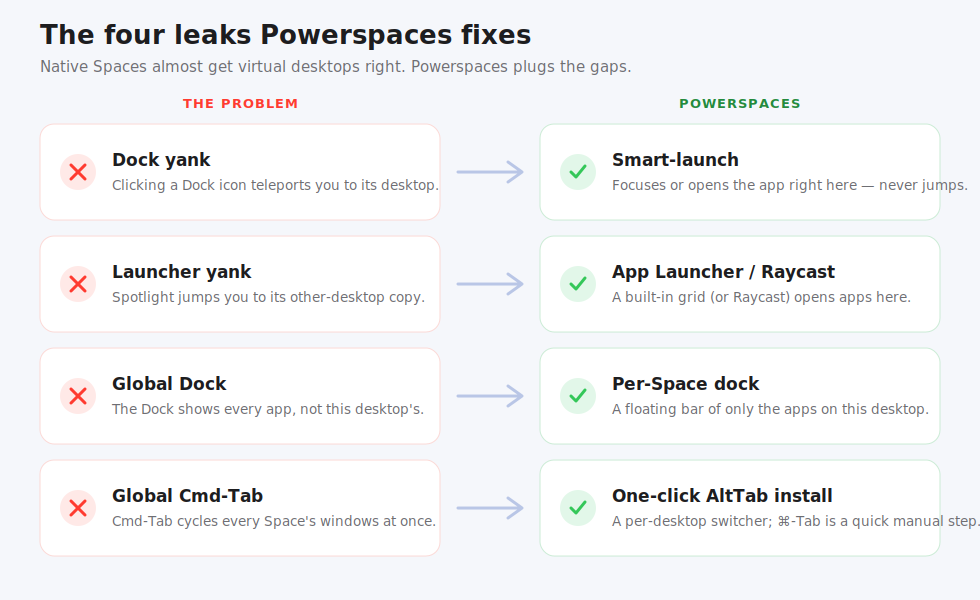

# Powerspaces: User Guide

<p align="center">
  
</p>

**Make macOS Spaces feel like real virtual desktops.** Powerspaces is a tiny,
native menu-bar app that stops the Dock and launchers from *yanking* you to
another desktop, and gives each desktop its own dock, so every desktop finally
behaves like its own isolated workspace, the way Windows virtual desktops do.

It **augments** native Spaces: your swipe gestures, Mission Control, and Spaces
all keep working. No SIP changes, no kernel extensions, no Screen Recording.

> This is the short version. For every feature, preference, and edge case, see the
> **[Extensive user guide](user-guide-extensive.md)**.

---

## What it fixes

<p align="center">
  
</p>

| The leak | What Powerspaces does |
|---|---|
| Clicking a Dock icon jumps you to the app's other desktop | **Smart-launch:** focus the app *here*, or open a fresh window *here*, but never jump |
| A launcher (Spotlight) opens the app's copy on another desktop | A built-in **App Launcher** (or the **Raycast extension**) opens any app right *here* |
| The Dock shows *every* app | A **per-desktop dock** showing only the apps on the desktop you're on |
| Cmd-Tab cycles every desktop's windows | A one-click **AltTab** install gives you a per-desktop switcher (making ⌘-Tab the trigger is a quick manual step) |

The heart of it: **focus-if-here, else open a new window here, and never jump away.**

---

## Install

You need Apple's **Command Line Tools** (`xcode-select --install` if `swift
--version` fails). Then, from the repo:

```sh
./scripts/install-app.sh             # builds & installs Powerspaces.app
open /Applications/Powerspaces.app
```

Powerspaces appears in your menu bar (a small power-window glyph) with its own Dock
icon. For the full effect, set the native Dock to auto-hide (or flip on
**Preferences → System → Hide the macOS Dock**) so the Powerspaces bar becomes
your everyday dock.

---

## Using the per-desktop dock

A floating bar shows only the apps with a window on the desktop you're on, and
updates as you switch desktops.

- **Click** an icon to bring that app's window here to the front (or smart-launch it
  here if it isn't open on this desktop).
- **Click again** when it's frontmost to minimize it.
- **Shift- or Option-click** to force a brand-new window here.
- **Drag an app onto the bar** to pin it to this desktop.
- **Right-click** for a per-app menu: open a new window, pin/unpin (this desktop or
  all desktops), close on this desktop, or quit.

### Pin apps to a desktop

Pinned apps always show in that desktop's dock (**even when they aren't running**),
so each desktop keeps its own set. Pins survive reboots
(`~/.config/powerspaces/pins.json`). Pin to *all* desktops for the apps you always
want one click away.

---

## More you can turn on

### The App Launcher

The **App Launcher** adds a Launchpad-style tile to the bar (on by default): type to
search every installed app and launch it **on the current desktop**. Turn it off in
**Preferences → Windows → App Launcher** if you'd rather not have the tile.

### Open from Raycast (Spotlight-style search)

Prefer launching from a search bar? Powerspaces ships a **Raycast extension** whose
*Open on Current Space* command opens any app on the desktop you're on, fixing the
Spotlight-style yank. Set it up from **Preferences → System → Raycast**.

### Per-desktop Cmd-Tab

Open **Preferences → System → Per-desktop Cmd-Tab (AltTab)** to detect/install the
free [AltTab](https://alt-tab.app) app and one-click-set it to show only the current
desktop's windows. One quick manual step in AltTab makes ⌘-Tab the trigger.

### Faster desktop switching

Flip on **Preferences → Behavior → Faster desktop switch** to make moving between
desktops *instant*. It skips macOS's slide animation, so multitasking feels much
snappier. Works with your trackpad swipe and/or keyboard shortcut; needs
Accessibility.

---

## Permissions

**Only one permission is needed: Accessibility**, used to raise the exact window. Grant
it in System Settings → Privacy & Security → Accessibility, then relaunch.

Everything else is deliberately **not** required:

- **Screen Recording: not needed.** The dock uses app identity, not window thumbnails.
- **No SIP changes, no kernel extensions.** Powerspaces only *reads* window/Space
  info, so System Integrity Protection stays on.

Your settings live in plain files under `~/.config/powerspaces/`, so they survive
reinstalls. And when you want a clean slate, **Preferences → System → Uninstall**
removes the app, the CLI, and (if you choose) your settings in one go.

---

## Good to know (current limitations)

None of these are bugs; they're the real macOS constraints the design works within:

- **New windows are app-dependent.** Browsers, editors, Finder, and Safari open a
  fresh window on the current desktop perfectly. Truly single-instance apps
  (Messages, System Settings) can't, so for those you pick how Powerspaces reacts:
  **show a warning**, **move the window here** (when the app supports it), or **quit
  it on the other desktop and reopen it here**.
- **It augments Spaces, it doesn't replace them**, so swipe gestures and Mission
  Control stay exactly as they are.
- **Per-desktop Cmd-Tab uses AltTab**, a separate free app, with one manual step to
  finish the ⌘-Tab setup.
- **The dock refreshes on a fast timer** (a light poll, tunable) because macOS doesn't
  announce every window open/close.
- **Multi-monitor is supported** (a dock per screen), with a few edge cases still
  lightly handled.

---

📚 More: [Extensive user guide](user-guide-extensive.md) · [Getting started](getting-started.md)
· [docs index](README.md)
